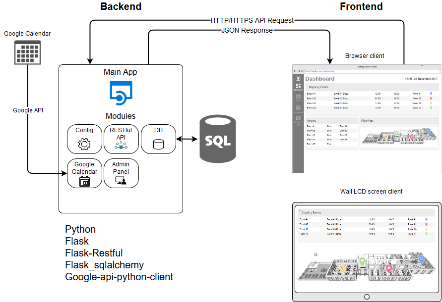
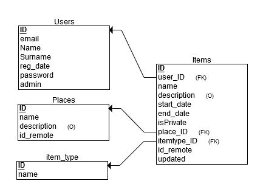

## Meeting Room Keeper Project
#### Full Stack Web Development Specialization. Capstone Project
#### Coursera.org | The Hong Kong University of Science and Technology


**RESTful API Server**


Test Server <https://meeting-room-keeper.eu-gb.mybluemix.net/>


### 1. Introduction
The project intended to help IT campuses and co-working spaces to serve their events scheduler, messages, alerts,
resources and meeting rooms’ reservation instead of shared Google calendars. It is aimed simplify the process and enhance the quality
of their booking services.


### 2. Design and Implementation
The general structure of the project



The basic backend architecture builded using FLASK framework extended with flask-restful, flask_sqlalchemy,
google-api-python-client and flask-cors extensions.


#### 2.1 The RESTful API Specification
To build the RESTful module we used the Flask-Restful extension for Flask that adds support for
quickly building REST APIs.


_The brief API endpoints specification_

**Items** (Event, Info, Alert, Message)

| endpoint                              | method  | scope       | description                                           |
|---------------------------------------|---------|-------------|-------------------------------------------------------|
| /items                                | GET     | ALL         | All items list                                        |
|                                       | POST    | ALL         | Create new item                                       |
|                                       | DELETE  | Admin       | Remove all items                                      |
| /items/:itemID                        | GET     | ALL         | Item details where Items.ID==itemID                   |
|                                       | PUT     | User/Admin  | Update data of User&#39;s item where Items.ID==itemID |
|                                       | DELETE  | User/Admin  | Remove User&#39;s item with Items.ID==itemID          |
| /items/dates/:start\_date             | GET     | ALL         | Get items on date                                     |
| /items/dates/:start\_date/:end\_date  | GET     | ALL         | Get items in date range                               |
| /items/now                            | GET     | ALL         | Get ongoing items                                     |


**Places**

| endpoint                                                | method  | scope | description                                       |
|---------------------------------------------------------|---------|-------|---------------------------------------------------|
| /places                                                 | GET     | ALL   | All places list                                   |
|                                                         | POST    | Admin | Create new place                                  |
|                                                         | DELETE  | Admin | Remove all places                                 |
| /places/:placeID                                        | GET     | ALL   | place details where places.ID==placeID            |
|                                                         | PUT     | Admin | Update data of place where places.ID==placeID     |
|                                                         | DELETE  | Admin | Remove place with places.ID==placeID              |
| /places/:place\_id/items/dates/:start\_date             | GET     | ALL   | Get items related to place on date                |
| /places/:place\_id/items/dates/:start\_date/:end\_date  | GET     | ALL   | Get items related to place in date range          |
| /places/:place\_id/items/now                            | GET     | ALL   | Get ongoing event &amp; upcoming event for place  |


**Users**

| endpoint        | method  | scope       | description                     |
|-----------------|---------|-------------|---------------------------------|
| /users          | GET     | Admin       | All users list. Admins Only     |
|                 | DELETE  | Admin       | Remove all users except admins  |
|                 | POST    | ALL         | Create or Register  a new user  |
| /users/:userID  | GET     | Admin       | User info                       |
|                 | PUT     | User/Admin  | Update user info                |
|                 | DELETE  | User/Admin  | Remove user account             |
| /user/login     | POST    | email/pwd   | Login user with email &amp; pwd |
| /user/logout    | GET     |             | Logout current user             |
| /user/whois     | GET     |             | Logged on User detail           |


#### 2.2 Front-end Architecture Design


##### 2.3 Database Schemas, Design and Structure




_Tables structure_


**Users**

| Field     | Type      | CONSTRAINT                  | Description                                                                 |
|-----------|-----------|-----------------------------|-----------------------------------------------------------------------------|
| id        | INTEGER   | PRIMARY KEY  AUTOINCREMENT  | User ID.                                                                    |
| email     | TEXT      | NOT NULL UNIQUE             | email                                                                       |
| name      | TEXT      | NOT NULL                    |                                                                             |
| surname   | TEXT      | NOT NULL                    |                                                                             |
| reg\_date | DATETIME  | DEFAULT CURRENT\_TIMESTAMP  | Registration date                                                           |
| password  | TEXT      | NOT NULL                    | Plain text password for the 1-2 milestones Will be changed to password hash |
| admin     | BOOLEAN   | DEFAULT 0                   | User is administrator = 1                                                   |


**Places**

| Field       | Type    | CONSTRAINT                  | Description                                               |
|-------------|---------|-----------------------------|-----------------------------------------------------------|
| id          | INTEGER | PRIMARY KEY   AUTOINCREMENT | Place ID                                                  |
| name        | TEXT    | NOT NULL UNIQUE             | Place name. Ex: Terrace, CoffeeBarSpace, Room1, Room2     |
| description | TEXT    |                             | Optional description                                      |
| id\_remote  | TEXT    |                             | generated Google Calendar ID - unique for every calendar  |


**Item\_type (predefined table )**

| Field | Type    | CONSTRAINT  | Description                                           |
|-------|---------|-------------|-------------------------------------------------------|
| id    | INTEGER | PRIMARY KEY |                                                       |
| name  | TEXT    | NOT NULL    | Predefined rows (1=Event, 2=Info, 3=Alert, 4=Message) |


**Items**

| Field         | Type      | CONSTRAINT                          | Description                                                                         |
|---------------|-----------|-------------------------------------|-------------------------------------------------------------------------------------|
| id            | INTEGER   | PRIMARY KEY AUTOINCREMENT           |                                                                                     |
| name          | TEXT      | NOT NULL                            |                                                                                     |
| description   | TEXT      |                                     | Optional                                                                            |
| start\_date   | DATETIME  | NOT NULL                            |                                                                                     |
| end\_date     | DATETIME  | NOT NULL                            |                                                                                     |
| isPrivate     | BOOLEAN   | DEFAULT 0                           | Public - 0, Private -1                                                              |
| user\_id      | INTEGER   | NOT NULL REFERENCES users (id)      | Item related to user with user\_id=users.ID                                         |
| place\_id     | INTEGER   | REFERENCES places (id)              | Item  related to the place. Could be NULL if item intend for all places (ex:Alert)  |
| itemtype\_id  | INTEGER   | NOT NULL REFERENCES item\_type (id) |                                                                                     |
| id\_remote    | TEXT      |                                     | generated Google Calendar ID - unique for every calendar                            |
| updated       | BOOLEAN   | DEFAULT 0                           | False - 0, True -1                                                                  |


#### 2.4 Communication
Clients will use HTTP/HTTPS protocol to request data from RESTful API by calling predefined
endpoints using the correct method. In response will receive JSON data structured mostly like the Items
DB table.


_API call example:_

<https://meeting-room-keeper.eu-gb.mybluemix.net/api/places/1/items/dates/2017-12-22T23:00:00>


_JSON response example:_

```JSON
{
    "items": [
        {
            "id": 282,
            "name": "1-2am 1h event. Room-1.  2017-12-23",
            "description": "some description",
            "start_date": "2017-12-23T00:00:00Z",
            "end_date": "2017-12-23T01:00:00Z",
            "user": {
                "id": 1,
                "name": "John Doe"
            },
            "place": {
                "id": 1,
                "name": "Room 1"
            },
            "item_type": {
                "id": 1,
                "name": "event"
            }
        },
        {
            "id": 304,
            "name": "my first test event",
            "description": "test desc",
            "start_date": "2017-12-23T02:00:00Z",
            "end_date": "2017-12-23T06:00:00Z",
            "user": {
                "id": 1,
                "name": "John Doe"
            },
            "place": {
                "id": 1,
                "name": "Room 1"
            },
            "item_type": {
                "id": 1,
                "name": "event"
            }
        }
    ]
}
```

### DB init and server running
Create database
```sh
./db-create
```

Insert fake data
```sh
./db-fakedata
```

Run server
```sh
./run.py
```


## References
* Flask <http://flask.pocoo.org/>
* Flask RESTful <https://flask-restful.readthedocs.io/en/latest/index.html>
* SQLAlchemy <http://docs.sqlalchemy.org/en/rel_1_1/orm/index.html>
* Flash-SQLAlchemy <http://flask-sqlalchemy.pocoo.org/2.3/>
* Google calendar API for python <https://developers.google.com/google-apps/calendar/quickstart/python>

